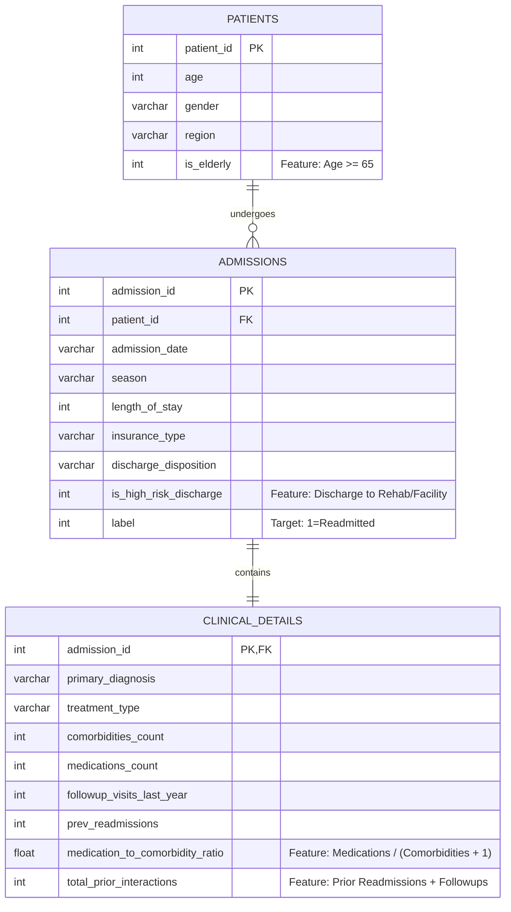

# 🩺 End-to-End Patient Readmission Pipeline & ROI Dashboard

[](https://www.python.org/)
[](https://www.sqlite.org/)
[](https://xgboost.readthedocs.io/)
[](https://streamlit.io/)

An **end-to-end, production-ready healthcare analytics system** that predicts hospital readmission risks (30-day patient returns) and mathematically optimizes preventative clinical care programs to maximize **Financial Return on Investment (ROI)**.

---

## 🚀 Interactive Live Demo
> **[View Live Interactive Dashboard Here](https://patient-readmission-risk-pipeline.streamlit.app/)**  
*Click the link above to access the interactive web dashboard, run ROI simulations, and test the real-time patient risk scorer.*

---

## 🏆 Key System Features

1. **Full-Stack Data Lifecycle:** Coordinates raw data ingestion, SQLite normalization, cross-validated training, score generation, and interactive dashboard delivery in a unified framework.
2. **Clinical-Domain Feature Engineering:** Implements active clinical risk signals, including medication-to-comorbidity ratio, patient frailty indexes, discharge destination risk weights, and length of stay relative to complexity.
3. **Dynamic Business Decision Optimization:** Evaluates risk scores under varying financial clinical parameters to identify the **Optimal Probability Threshold** that maximizes net healthcare system cost reductions.
4. **Relational Database Integration:** Normalizes flat-file transaction logs into three SQLite relational tables, executing advanced joining and aggregation queries—including calculating complex features (`stay_per_comorbidity`) directly inside the database engine.
5. **Modular Code Architecture:** Follows clean code standards with strict typing, comprehensive English documentation, and a clear separation of concerns under a structured `src/` package.

---

## 📂 Repository Architecture

```text
├── models/                     # Serialized ML artifacts & evaluation logs
│   ├── readmission_xgb_model.joblib
│   ├── evaluation_data.joblib
│   └── threshold_opt_data.joblib
├── notebooks/                  # Interactive presentation & exploratory notebooks
│   └── pipeline_exploration.ipynb
├── src/                        # Production modular pipeline package
│   ├── __init__.py
│   ├── ingest.py               # Raw Kaggle dataset downloading & path mapping
│   ├── transform.py            # Relational database normalization & Feature Engineering
│   ├── database.py             # SQLite loader and schema verification
│   ├── train.py                # Hyperparameter cross-validation (GridSearchCV) & SQL joins
│   └── inference.py            # Probability prediction & ROI threshold search
├── app.py                      # Interactive Streamlit Dashboard (ROI & Scorer UI)
├── main.py                     # Root-level pipeline orchestrator entrypoint
├── requirements.txt            # Python library dependencies
└── .gitignore                  # Keeps local database and model binaries out of Git
```

---

## 🗄️ Database Design & Clinical Features

We split the flat medical log into three normalized relational tables to enforce transaction efficiency and reduce data redundancies.



### 🧠 SQL Feature Engineering Highlight
During modeling, we extract features using a joining SQL query that computes the fifth clinical feature **`stay_per_comorbidity`** dynamically in the database engine:
```sql
SELECT 
    p.age, p.gender, p.region, p.is_elderly,
    a.season, a.length_of_stay, a.insurance_type, a.discharge_disposition, a.is_high_risk_discharge,
    c.primary_diagnosis, c.treatment_type, c.comorbidities_count, c.medications_count,
    c.followup_visits_last_year, c.prev_readmissions, c.medication_to_comorbidity_ratio,
    c.total_prior_interactions,
    -- Normalized discharge speed: Length of stay normalized by diagnosis counts
    (CAST(a.length_of_stay AS REAL) / (c.comorbidities_count + 1.0)) AS stay_per_comorbidity,
    a.label
FROM admissions a
JOIN patients p ON a.patient_id = p.patient_id
JOIN clinical_details c ON a.admission_id = c.admission_id
```

---

## 📊 Model Performance & Financial ROI Summary

By optimizing XGBoost hyperparameters under a **5-Fold Stratified Cross-Validation Grid Search** and applying clinical feature engineering, we achieved high predictive precision.

### 📈 Technical Metrics (Stratified Test Set)
- **Model Accuracy:** **81.19%**
- **Area Under ROC Curve (AUC):** **83.08%**
- **Optimal Hyperparameters:** `learning_rate: 0.05`, `max_depth: 3`, `n_estimators: 100`

### 💰 Executive ROI Business Impact (Threshold: 0.30)
- **Baseline Readmissions Cost (No Program):** **$92,745,000.00** (6,183 readmissions @ $15,000 each)
- **Preventative Intervention Investment:** **$9,267,600.00** (targeting high-risk patients @ $1,200 each)
- **Readmissions Successfully Prevented:** **1,842.00 readmissions** (assuming 30% program efficacy)
- **Gross Care Savings:** **$27,630,000.00**
- **Net Hospital Savings (Net Profit):** **$18,362,400.00**
- **Return on Investment (ROI):** **198.14%**
- **Overall System Healthcare Cost Reduction:** **19.80%**

---

## 🖥️ Getting Started & Local Setup

Follow these simple steps to run the pipeline and launch the dashboard locally on your machine:

### 1. Clone the repository and install requirements
```bash
git clone https://github.com/your-username/patient-readmission-risk-pipeline.git
cd patient-readmission-risk-pipeline
pip install -r requirements.txt
```

### 2. Run the End-to-End Pipeline
Executes data ingestion, normalizes the SQLite database, extracts features, runs GridSearchCV cross-validation, and saves metadata.
```bash
python main.py
```

### 3. Launch the Streamlit Dashboard
Spawns the local web server and opens the application in your default web browser.
```bash
streamlit run app.py
```
*Access the local portal directly at `http://localhost:8501`*
